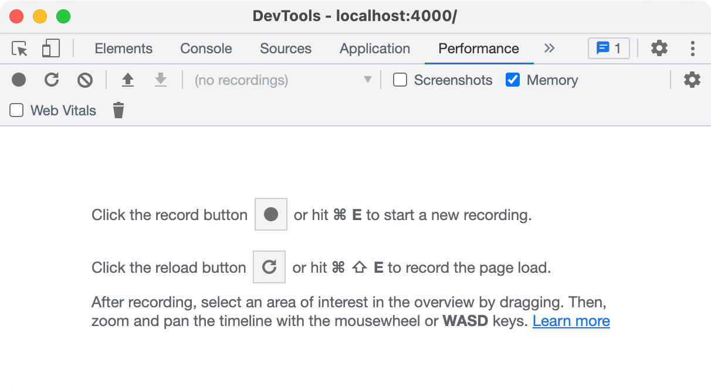
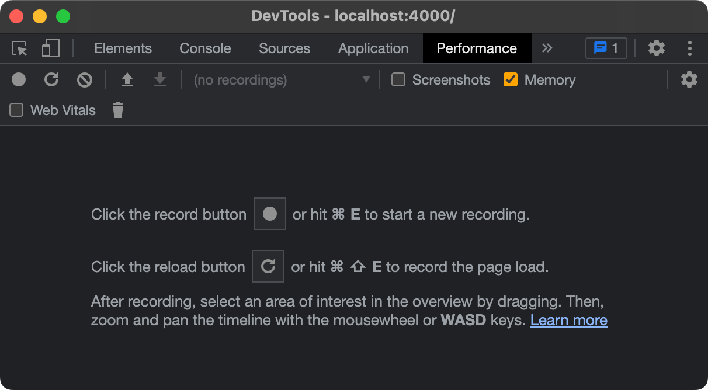

## Заголовки

<!-- markdownlint-capture -->
<!-- markdownlint-disable -->
# Заголовок H1 {data-toc-skip=true .mt-4 .mb-0 }

## Заголовок H2 {data-toc-skip=true .mt-4 .mb-0 }

### Заголовок H3 {data-toc-skip=true .mt-4 .mb-0 }

#### Заголовок H4 {data-toc-skip=true .mt-4 }
<!-- markdownlint-restore -->

## Абзац

Quisque egestas convallis ipsum, ut sollicitudin risus tincidunt a. Maecenas interdum malesuada egestas. Duis consectetur porta risus, sit amet vulputate urna facilisis ac. Phasellus semper dui non purus ultrices sodales. Aliquam ante lorem, ornare a feugiat ac, finibus nec mauris. Vivamus ut tristique nisi. Sed vel leo vulputate, efficitur risus non, posuere mi. Nullam tincidunt bibendum rutrum. Proin commodo ornare sapien. Vivamus interdum diam sed sapien blandit, sit amet aliquam risus mattis. Nullam arcu turpis, mollis quis laoreet at, placerat id nibh. Suspendisse venenatis eros eros.

## Списки

### Нумерованный список

1. Первый
2. Второй
3. Третий

### Маркированный список

- Глава
  - Раздел
    - Абзац

### Список задач

- [ ] Задание
  - [x] Шаг 1
  - [x] Шаг 2
  - [ ] Шаг 3

### Список описаний

Солнце
: звезда, вокруг которой вращается Земля

Луна
: естественный спутник Земли, видимый в отражённом свете солнца

## Цитата

> Эта строка демонстрирует _блочную цитату_.

## Подсказки

<!-- markdownlint-capture -->
<!-- markdownlint-disable -->
> Пример подсказки типа `tip`.
{.prompt-tip }

> Пример подсказки типа `info`.
{.prompt-info }

> Пример подсказки типа `warning`.
{.prompt-warning }

> Пример подсказки типа `danger`.
{.prompt-danger }
<!-- markdownlint-restore -->

## Таблицы

| Компания                     | Контакт          | Страна   |
| :--------------------------- | :--------------- | -------: |
| Alfreds Futterkiste          | Maria Anders     | Германия |
| Island Trading               | Helen Bennett    |  Велико­британия |
| Magazzini Alimentari Riuniti | Giovanni Rovelli |   Италия |

## Ссылки

<http://127.0.0.1:4000>

## Сноска

Нажмите на крючок, чтобы перейти к сноске[^footnote], и вот ещё одна сноска[^fn-nth-2].

## Встроенный код

Это пример `встроенного кода`.

## Путь к файлу

Вот путь .

## Блоки кода

### Обычный

```text
Это обычный фрагмент кода без подсветки синтаксиса и номеров строк.
```

### Конкретный язык

```bash
if [ $? -ne 0 ]; then
  echo "Команда завершилась неудачно.";
  #do the needful / exit
fi;
```

### Конкретное имя файла

```sass {file="_sass/jekyll-theme-chirpy.scss"}
@import
  "colors/light-typography",
  "colors/dark-typography";
```

## Математика

Математика реализована на базе [**MathJax**](https://www.mathjax.org/):

$$
\begin{equation}
  \sum_{n=1}^\infty 1/n^2 = \frac{\pi^2}{6}
  \label{eq:series}
\end{equation}
$$

Можно ссылаться на уравнение как \eqref{eq:series}.

Когда $a \ne 0$, уравнение $ax^2 + bx + c = 0$ имеет два решения:

$$ x = {-b \pm \sqrt{b^2-4ac} \over 2a} $$

## Изображения

### По умолчанию (с подписью)


{ width="972" height="589" caption="Полная ширина и центрирование"}

### Выравнивание влево


{ width="972" height="589" .w-75 .normal}

### Обтекание слева


{ width="972" height="589" .w-50 .left}
Praesent maximus aliquam sapien. Sed vel neque in dolor pulvinar auctor. Maecenas pharetra, sem sit amet interdum posuere, tellus lacus eleifend magna, ac lobortis felis ipsum id sapien. Proin ornare rutrum metus, ac convallis diam volutpat sit amet. Phasellus volutpat, elit sit amet tincidunt mollis, felis mi scelerisque mauris, ut facilisis leo magna accumsan sapien. In rutrum vehicula nisl eget tempor.

### Обтекание справа


{ width="972" height="589" .w-50 .right}
Praesent maximus aliquam sapien. Sed vel neque in dolor pulvinar auctor. Maecenas pharetra, sem sit amet interdum posuere, tellus lacus eleifend magna, ac lobortis felis ipsum id sapien. Proin ornare rutrum metus, ac convallis diam volutpat sit amet. Phasellus volutpat, elit sit amet tincidunt mollis, felis mi scelerisque mauris, ut facilisis leo magna accumsan sapien. In rutrum vehicula nisl eget tempor.

### Тёмный/светлый режим и тени

Изображение ниже переключается в зависимости от темы (с тенями).


{ .light .w-75 .shadow .rounded-10 w="1212" h="668" }

{ .dark .w-75 .shadow .rounded-10 w="1212" h="668" }

## Видео



## Обратные сноски

[^footnote]: Источник сноски
[^fn-nth-2]: Источник второй сноски
